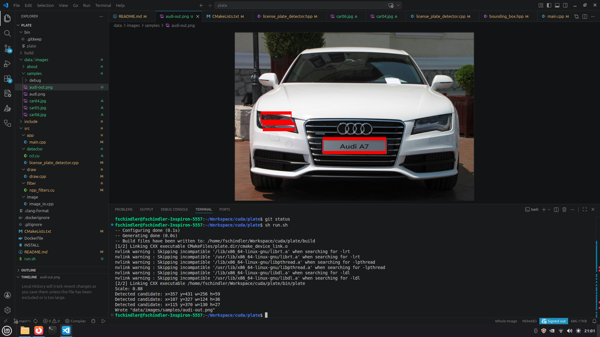

# Overview

`plate` is a small CUDA/C++ sample project that uses NVIDIA NPP for GPU-side image filtering and a simple classical heuristic to locate a likely license plate region in a `.png`, `.jpg`, or `.jpeg` image.

The pipeline is intentionally simple:

1. Load the image on the CPU.
2. Resize image ~1080x600 ratio `GPU`
3. Convert to grayscale on the `GPU`
4. Run Gaussian smoothing and Sobel edge extraction on the `GPU` with NPP.
6. Build the binary candidate mask on the `GPU`
7. Score connected (Connected-Component Labeling CCL using Label Propagation) components on the `GPU`
8. Draw a rectangle on the original image and save `<input>-out.<ext>`CPU

Detailed installation instructions are in `INSTALL`.

## Samples

**Many thanks**

- Car[05,06] <a href="https://unsplash.com/pt-br/@arteum?utm_source=unsplash&utm_medium=referral&utm_content=creditCopyText">Arteum.ro</a> at <a href="https://unsplash.com/pt-br/fotografias/carro-bmw-preto-estacionado-na-estrada-oaMFDtSqHXY?utm_source=unsplash&utm_medium=referral&utm_content=creditCopyText">Unsplash</a>

- Car[04] <a href="https://unsplash.com/pt-br/@flixxi?utm_source=unsplash&utm_medium=referral&utm_content=creditCopyText">Felix Janßen</a> at <a href="https://unsplash.com/pt-br/fotografias/porsche-911-preto-estacionado-no-chao-branco-2eMJDJM9vxk?utm_source=unsplash&utm_medium=referral&utm_content=creditCopyText">Unsplash</a>
      
      
## Code organization

```text
.
├── bin
├── data
│   └── images
│       └── samples
├── Dockerfile
├── INSTALL
├── include/plate
│   ├── core
│   ├── detector
│   ├── draw
│   ├── filter
│   └── image
├── src
│   ├── app
│   ├── detector
│   ├── draw
│   ├── filter
│   └── image
└── CMakeLists.txt
```

- `bin/` holds generated executables. After a successful build, the main CLI is written here as `bin/plate`.
- `data/` holds lightweight example data for the repository. Right now it contains sample input images under `data/images/samples/`, including `audi.png`.
- `include/plate/` holds public headers grouped by module.
- `src/` holds the implementation files for the application entrypoint and each module.

## Build Summary

The project is designed to compile in Docker on macOS and directly on Linux. The executable is written to `bin/` when you build it.

Quick Linux build:

```bash
cmake -S . -B build -G Ninja -DCMAKE_BUILD_TYPE=Release
cmake --build build --parallel
```

On Apple Silicon, Docker defaults to `linux/arm64`. If your target runtime machine is a typical x86_64 Linux NVIDIA box, build with `--platform=linux/amd64`.

Quick Docker build:

```bash
docker build --platform=linux/amd64 -t plate-build-env .

docker run --rm \
  --platform=linux/amd64 \
  -u "$(id -u):$(id -g)" \
  -v "$PWD:/workspace" \
  -w /workspace \
  plate-build-env \
  cmake -S . -B build -G Ninja -DCMAKE_BUILD_TYPE=Release -DCMAKE_CUDA_ARCHITECTURES=86

docker run --rm \
  --platform=linux/amd64 \
  -u "$(id -u):$(id -g)" \
  -v "$PWD:/workspace" \
  -w /workspace \
  plate-build-env \
  cmake --build build --parallel
```

## Run

The sample image lives at `data/images/samples/audi.png`.

Run the program on a Linux machine with a working CUDA runtime:

```bash
./bin/plate data/images/samples/audi.png
```

If a plausible candidate is found, the tool writes `data/images/samples/audi-out.png`.

To save the intermediate GPU stages under a `debug/` folder beside the input
image, use:

```bash
./bin/plate --debug data/images/samples/audi.png
```

This writes files such as `debug/audi-grayscale.png`,
`debug/audi-gauss-blur.png`, `debug/audi-sobel-edge.png`,
`debug/audi-binary-mask.png`, and `debug/audi-closed-mask.png`.

## Notes and limitations

- The detector is heuristic-based and tuned for rectangular plates with strong edge contrast.
- The current implementation expects  `png/jpg/jpeg`.
- Image decoding/encoding is handled by OpenCV inside the `image` module; the filtering path uses CUDA/NPP.
- It is not intend to detected real license plates

## Example

